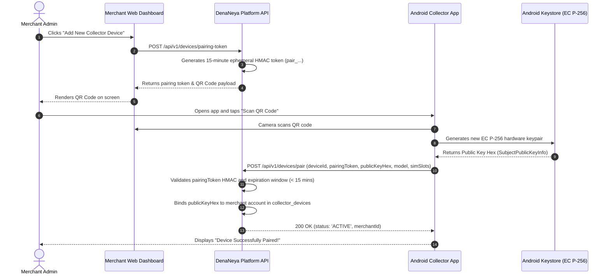
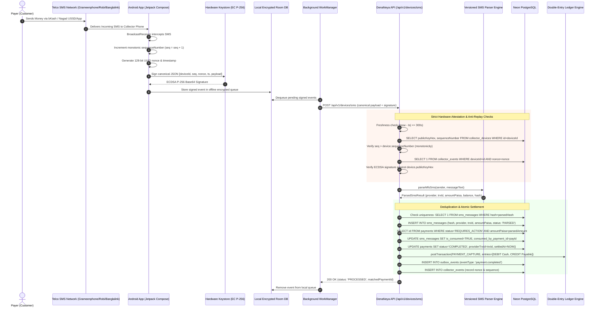

# Android SMS Collector Architecture, Keystore Security & Pairing Protocol

> **"দেনা-নেওয়া সহজ, হিসাব নিশ্চিত।"**  
> *Seamless Payments, Guaranteed Accounting.*

This document specifies the technical architecture, cryptographic hardware attestation, local persistence, and offline queueing implementation of the native Android application (`apps/android`).

---

## 1. Native Mobile Architecture & Tech Stack

The collector application is written in native **Kotlin** using modern Android architecture components:
- **UI Toolkit**: Jetpack Compose with Material 3 design system.
- **Architecture**: Clean Architecture (Domain, Data, Presentation layers) with Unidirectional Data Flow (UDF).
- **Background Scheduling**: Android Jetpack `WorkManager` with exponential backoff retry.
- **Local Persistence**: `Room` database encrypted with **SQLCipher** (256-bit AES database encryption).
- **Hardware Cryptography**: Android Keystore Provider with hardware-backed `Keymaster` / `StrongBox` hardware security modules.

```
┌────────────────────────────────────────────────────────────────────────┐
│              apps/android Native Application Architecture             │
├────────────────────────────────────────────────────────────────────────┤
│                               UI Layer                                 │
│         Jetpack Compose Screens: Dashboard, Pairing QR, Events Log     │
├────────────────────────────────────────────────────────────────────────┤
│                            Domain Layer                                │
│       Use Cases: IngestSmsUseCase, PairDeviceUseCase, SyncQueueUseCase │
├────────────────────────────────────────────────────────────────────────┤
│                             Data Layer                                 │
│   ┌─────────────────────┐   ┌─────────────────┐   ┌────────────────┐   │
│   │ Telephony Receiver  │   │ Encrypted Room  │   │  WorkManager   │   │
│   │  & NotificationSvc  │   │  (SQLCipher DB) │   │ BackgroundSync │   │
│   └──────────┬──────────┘   └────────┬────────┘   └───────┬────────┘   │
├──────────────┼───────────────────────┼────────────────────┼────────────┤
│              ▼                       ▼                    ▼            │
│                 Android Keystore (Hardware EC P-256)                   │
│               Signs Canonical Envelopes with Secure Key                │
└────────────────────────────────────────────────────────────────────────┘
```

---

## 2. Hardware Keystore Security & EC P-256 Attestation

The Android app transforms commodity Android devices into cryptographically attested hardware payment sensors:

### 2.1 Hardware-Backed Keypair Generation
Upon installation, the app requests the Android Keystore to generate an asymmetric Elliptic Curve keypair:
- **Algorithm**: `KeyProperties.KEY_ALGORITHM_EC`
- **Curve**: NIST P-256 (`secp256r1`)
- **Purposes**: `KeyProperties.PURPOSE_SIGN | KeyProperties.PURPOSE_VERIFY`
- **Digest**: `KeyProperties.DIGEST_SHA256`
- **Hardware Isolation**: `setIsStrongBoxBacked(true)` (with fallback to TEE on devices without dedicated StrongBox chips).
- **Non-Exportability**: The private key is flagged non-exportable (`setUserAuthenticationRequired(false)`). The private key bits **NEVER** leave the hardware enclave. Signing occurs solely inside the secure cryptoprocessor.

```kotlin
val keyPairGenerator = KeyPairGenerator.getInstance(
    KeyProperties.KEY_ALGORITHM_EC, 
    "AndroidKeyStore"
)
val parameterSpec = KeyGenParameterSpec.Builder(
    KEY_ALIAS,
    KeyProperties.PURPOSE_SIGN or KeyProperties.PURPOSE_VERIFY
)
    .setDigests(KeyProperties.DIGEST_SHA256)
    .setAlgorithmParameterSpec(ECGenParameterSpec("secp256r1"))
    .build()

keyPairGenerator.initialize(parameterSpec)
keyPairGenerator.generateKeyPair()
```

---

## 3. QR Pairing Protocol Ceremony

Pairing links an Android collector device to a specific merchant account without exposing long-lived credentials:



---

## 4. Transmission-Time Sequence Monotonicity & Replay Defense

When an MFS transaction SMS arrives on the device, the app wraps the SMS in an anti-replay envelope:

```json
{
  "deviceId": "dev_4b8f9e01",
  "sequenceNumber": 104,
  "nonce": "e3b0c442-98fc-1c14-9afb-4c8996fb9242",
  "timestamp": 1726270050000,
  "eventType": "SMS_RECEIVED",
  "payload": {
    "sender": "bKash",
    "messageText": "You have received Tk 1,500.00 from 01712345678. Fee Tk 0.00. Balance Tk 45,210.50. TrxID 9K76TRX01 at 14/09/2026 02:05",
    "receivedAt": 1726270048000,
    "simSlot": 0,
    "batteryLevel": 88
  },
  "signature": "MEQCIBY7L+3oQ1..."
}
```

### 4.1 Monotonic Sequence Numbering
Each event assigned a sequence number strictly greater than the previous one:
$$\text{sequenceNumber}_{k} = \text{sequenceNumber}_{k-1} + 1$$
If a network attacker attempts to replay a previously intercepted event, the backend rejects it with `EVENT_REPLAY_DETECTED` because the sequence number is not strictly greater than the recorded sequence in `collector_devices`.

### 4.2 Nonce Uniqueness & Clock Drift Window
- **Nonce**: 128-bit random UUIDv4 checked against database unique index `idx_collector_events_device_nonce`.
- **Clock Drift**: Device timestamp must satisfy $|t_{\text{server}} - t_{\text{device}}| \le 300\text{ seconds}$.

---

## 5. Offline Queue & Resilient Transport

In emerging markets, mobile devices frequently encounter intermittent network drops. The collector implements an offline queue using **SQLCipher**:



### 5.1 OEM Battery Whitelisting
Aggressive OEM battery killers (MIUI, ColorOS, OneUI) routinely terminate background services. The application programmatically requests battery optimization exemption via `Settings.ACTION_REQUEST_IGNORE_BATTERY_OPTIMIZATIONS`, accompanied by an ongoing foreground service with an active notification when listening for incoming transactions.
