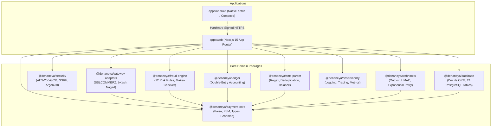
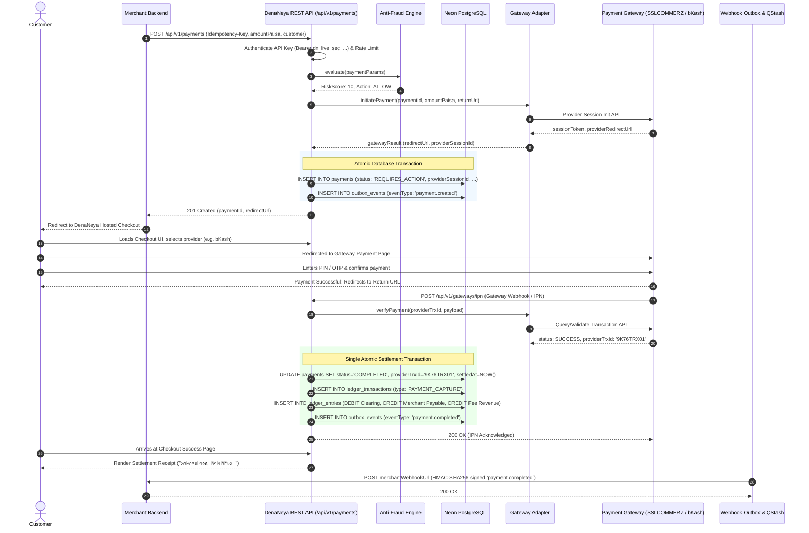
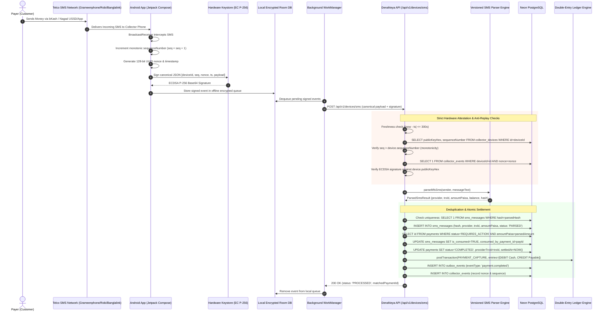

# DenaNeya System Architecture & High-Performance Payment Topology

> **"দেনা-নেওয়া সহজ, হিসাব নিশ্চিত।"**  
> *Seamless Payments, Guaranteed Accounting.*

This document details the software architecture, package boundaries, data pipelines, state machines, and concurrency protection mechanisms that govern the DenaNeya payment management and orchestration platform.

---

## 1. Core Architectural Principles

DenaNeya is engineered around three non-negotiable financial systems principles:

1. **Zero-Float Integer Minor Unit Representation (`paisa`)**:
   In accordance with enterprise banking standards, floating-point arithmetic is strictly prohibited in monetary computation. Floating-point types introduce binary rounding errors (e.g., `0.1 + 0.2 === 0.30000000000000004`). All monetary values throughout the database, business logic, TypeScript interfaces, and REST API payloads are stored and calculated as integers representing **paisa** (`1 BDT = 100 paisa`). For example, 1,500.00 BDT is strictly represented as `150000`. In JSON serialization, large minor units are represented as numeric strings to protect JavaScript clients from 64-bit IEEE 754 precision degradation.

2. **Immutable Double-Entry Ledger Invariant**:
   Every state change involving financial movement is recorded in a balanced double-entry journal. Every transaction consists of balanced journal lines where:
   $$\sum \text{Debits} \equiv \sum \text{Credits}$$
   Ledger postings are strictly append-only; historical entries are never updated or deleted. Reversals and corrections occur solely via opposing offset transactions.

3. **Exactly-Once Settlement Guarantees**:
   The platform enforces exactly-once business settlement through multi-layered concurrency defenses: database uniqueness constraints on provider transaction identifiers (`provider_trx_id`), SHA-256 cryptographic hashing of incoming SMS notifications, idempotency keys with unique indexes per tenant, and single atomic database transactions wrapping state transitions, ledger postings, and transactional outbox events.

---

## 2. Monorepo Package Topology & Dependencies

The system is constructed as a modular TypeScript monorepo with clean boundary isolation. Workspace packages communicate via typed domain contracts:



---

## 3. C4 Container Architecture

The following C4 Container Diagram specifies the execution boundaries, data stores, external network integrations, and runtime environments of DenaNeya:

```mermaid
C4Container
    title Container Diagram for DenaNeya Payment Orchestration Platform

    Person(customer, "Customer / Payer", "Purchases goods/services via hosted checkout or direct MFS transfer.")
    Person(merchant, "Merchant Operator", "Manages payments, links, invoices, API keys, and devices via Dashboard.")
    Person(admin, "Platform Admin / Risk Officer", "Monitors gateway health, reviews dual-control cases, and triggers reconciliation.")

    System_Boundary(c1, "DenaNeya Monorepo Platform") {
        Container(webApp, "Next.js Web Application", "Next.js 15 App Router, TypeScript, Tailwind", "Serves Marketing, Merchant/Admin Dashboard, Hosted Checkout, Docs Portal, and REST API v1.")
        
        Container(pkgSecurity, "packages/security", "AES-256-GCM, Argon2id", "Envelope encryption for credentials/secrets, SSRF DNS guard, RBAC, and rate limiting.")
        Container(pkgPaymentCore, "packages/payment-core", "TypeScript Strict", "Paisa minor-unit math (zero float), 11-state state machine, and Zod schemas.")
        Container(pkgLedger, "packages/ledger", "Double-Entry Accounting", "5-tier Chart of Accounts, atomic journal settlement, debit=credit invariant.")
        Container(pkgFraud, "packages/fraud-engine", "Rule Engine", "12 weighted risk rules (0-100), automated thresholds, Maker-Checker queue.")
        Container(pkgAdapters, "packages/gateway-adapters", "Adapter Pattern", "Unified GatewayAdapter interface for SSLCOMMERZ, bKash, Nagad, shurjoPay, aamarPay.")
        Container(pkgSmsParser, "packages/sms-parser", "Regex Engine", "Versioned parsers for bKash, Nagad, Rocket, Upay, SHA-256 hash deduplication, balance chain.")
        Container(pkgWebhooks, "packages/webhooks", "Transactional Outbox", "HMAC-SHA256 event signing, 5x exponential retry, Dead Letter Queue.")

        ContainerDb(dbPostgres, "Neon Serverless PostgreSQL", "PostgreSQL 16, Drizzle ORM", "21 relational tables with unique constraints, idempotency keys, hash chaining, and trigger guards.")
    }

    Container(androidApp, "Android SMS Collector", "Native Kotlin, Jetpack Compose, Room DB, WorkManager", "Captures MFS SMS, hardware-signs with Keystore EC P-256, offline queue sync.")
    Container_Ext(qstash, "Upstash QStash", "Serverless HTTP Message Queue", "Drives asynchronous webhook retries, scheduled reconciliation crons, and background workers.")
    Container_Ext(gateways, "Upstream Gateways & MFS", "SSLCOMMERZ, bKash, Nagad, etc.", "Executes external payment capture, verification, and refunds.")
    Container_Ext(merchantServer, "Merchant Backend", "HTTPS Webhook Listener & REST Client", "Receives signed payment notifications and creates orders via API.")

    Rel(customer, webApp, "Visits checkout, selects payment method", "HTTPS")
    Rel(merchant, webApp, "Manages account, generates API keys", "HTTPS")
    Rel(admin, webApp, "Performs Maker-Checker approvals & audits", "HTTPS")

    Rel(webApp, dbPostgres, "Executes transactional queries", "Postgres Wire / SSL")
    Rel(webApp, pkgPaymentCore, "Validates transitions & amounts", "In-Process")
    Rel(webApp, pkgLedger, "Posts journal transactions", "In-Process")
    Rel(webApp, pkgFraud, "Evaluates payment risk scores", "In-Process")
    Rel(webApp, pkgAdapters, "Initiates provider sessions", "HTTPS")
    Rel(pkgAdapters, gateways, "Dispatches payment API requests", "HTTPS / JSON / XML")

    Rel(androidApp, webApp, "Submits signed SMS and heartbeats", "HTTPS / POST /api/v1/devices/*")
    Rel(webApp, pkgSmsParser, "Parses SMS and verifies balance", "In-Process")

    Rel(webApp, qstash, "Schedules background tasks and retries", "HTTPS / REST")
    Rel(qstash, webApp, "Invokes webhook dispatch worker", "HTTPS / POST")
    Rel(webApp, merchantServer, "Delivers signed HMAC-SHA256 webhooks", "HTTPS / POST")
    Rel(merchantServer, webApp, "Invokes REST API with API keys", "HTTPS / Bearer Auth")
```



---

## 4. Payment Settlement State Machine

DenaNeya implements an explicit 11-state Finite State Machine (FSM) defined in `@denaneya/payment-core`. Any state transition not explicitly listed below is rejected at both application and database trigger levels:

```
                                  [CREATED]
                                      │
                                      ▼
                             [REQUIRES_ACTION]
                                      │
                         ┌────────────┴────────────┐
                         ▼                         ▼
                     [PENDING]              [PROCESSING]
                         │                         │
                         ├─────────────────────────┤
                         ▼                         ▼
                  [UNDER_REVIEW]              [COMPLETED]
                         │                         │
                         │             ┌───────────┴───────────┐
                         ▼             ▼                       ▼
                      [FAILED]  [PARTIALLY_REFUNDED]       [REFUNDED]
                         ▲             │                       ▲
                         │             └───────────────────────┘
                   [CANCELLED] / [EXPIRED]
```

### Complete State Transition Matrix

| Source State | Allowed Destination States | Trigger / Condition |
|---|---|---|
| `CREATED` | `REQUIRES_ACTION`, `FAILED`, `CANCELLED` | Payment created; awaiting payer method selection or client abort |
| `REQUIRES_ACTION` | `PENDING`, `PROCESSING`, `UNDER_REVIEW`, `FAILED`, `EXPIRED`, `CANCELLED` | Payer redirected to gateway or initiated USSD transfer |
| `PENDING` | `PROCESSING`, `UNDER_REVIEW`, `COMPLETED`, `FAILED`, `EXPIRED`, `CANCELLED` | Upstream provider acknowledgment received |
| `PROCESSING` | `UNDER_REVIEW`, `COMPLETED`, `FAILED` | Gateway callback received or SMS matched; settling |
| `UNDER_REVIEW` | `COMPLETED`, `FAILED` | Dual-control Maker-Checker case resolved by authorized risk officers |
| `COMPLETED` | `PARTIALLY_REFUNDED`, `REFUNDED` | Refund issued against settled transaction |
| `PARTIALLY_REFUNDED`| `PARTIALLY_REFUNDED`, `REFUNDED` | Subsequent partial refund or final full refund balance closure |
| `FAILED` | None (Terminal) | Unrecoverable error, timeout, or fraud engine auto-reject |
| `CANCELLED` | None (Terminal) | Explicit cancellation by payer or merchant |
| `EXPIRED` | None (Terminal) | Payment window expired without payment submission |
| `REFUNDED` | None (Terminal) | Total captured amount has been 100% refunded |

---

## 5. Trust Tier Verification Hierarchy

To preserve financial integrity across diverse payment ingestion channels, DenaNeya categorizes every transaction into an explicit **Trust Tier**:

| Tier | Tier Name | Ingestion Mechanism | Verification & Cryptographic Guarantees | Settlement Risk Level |
|---|---|---|---|---|
| **Tier A** | Official Direct API | Gateway Direct Server API (bKash PGW, Nagad, SSLCOMMERZ) | Mutual TLS / API key + server-to-server query verification | Lowest (Direct Automated Settlement) |
| **Tier B** | Signed Webhook | Provider IPN / Webhook Callback | Provider HMAC / RSA signature check + server query verification | Low (Verified Provider Callback) |
| **Tier C** | Authenticated SMS Device | Hardware-backed Android Collector (`apps/android`) | Hardware Keystore EC P-256 signature, monotonic seq, balance-chain check | Medium (Attested Mobile Extraction) |
| **Tier D** | Manual Entry | Merchant Backoffice Operator | Dual-control Maker-Checker review with mandatory KYC / receipt upload | High (Requires Human Dual Approval) |

---

## 6. Payment Processing Pipelines

### 6.1 Synchronous Hosted Checkout Flow

The hosted checkout flow allows merchants to redirect customers to DenaNeya’s secure payment gateway, execute the payment with Bangladesh MFS or card networks, verify upstream callbacks, post double-entry ledger journals, and notify the merchant via webhook:



### 6.2 Asynchronous Android MFS SMS Ingestion Flow

For merchants operating direct MFS personal/merchant SIMs, DenaNeya captures real-time SMS receipts via a paired Android phone running hardware-backed EC P-256 key attestation:



---

## 7. Financial Consistency & Concurrency Protection

To guarantee that no race conditions result in duplicate settlements or accounting anomalies, DenaNeya employs four interlocking database controls:

1. **Idempotency Guard**:
   API requests specify an `Idempotency-Key` header. The database enforces a `UNIQUE(merchant_id, idempotency_key)` index on `payments`. If a duplicate request arrives while the original is in flight or completed, the database catches the collision and returns the original response with `Idempotent-Replayed: true`.

2. **Provider Transaction Uniqueness**:
   The `payments` table maintains a partial unique index:
   ```sql
   CREATE UNIQUE INDEX idx_payments_provider_trx_unique 
   ON payments (provider, provider_trx_id) 
   WHERE provider_trx_id IS NOT NULL AND status = 'COMPLETED';
   ```
   If twenty concurrent worker processes or malicious actors submit the same provider TrxID, exactly one succeeds; the remaining nineteen fail with a PostgreSQL uniqueness violation.

3. **SMS Cryptographic Hash Deduplication**:
   When an SMS notification is parsed, a canonical SHA-256 fingerprint is generated:
   $$\text{hash} = \text{SHA-256}(\text{provider} + \text{trxId} + \text{amountPaisa} + \text{sender})$$
   A `UNIQUE(hash)` constraint on `sms_messages` ensures identical SMS broadcasts from mobile carriers cannot be re-inserted or re-processed.

4. **Single-Settlement Atomic Transaction**:
   Payment status transition (`status = 'COMPLETED'`), ledger journal creation (`ledger_transactions` and `ledger_entries`), SMS consumption marking (`is_consumed = TRUE`), and outbox event enqueueing (`outbox_events`) occur strictly inside a single database transaction (`db.transaction(...)`). If any component fails, the entire transaction rolls back cleanly.
