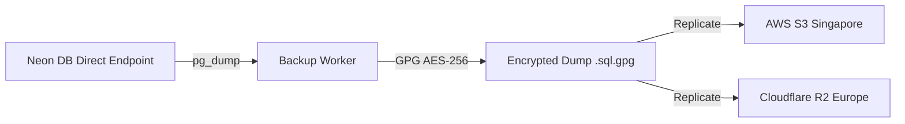

# Disaster Recovery (DR), Business Continuity & Backup Procedures

> **"দেনা-নেওয়া সহজ, হিসাব নিশ্চিত।"**  
> *Seamless Payments, Guaranteed Accounting.*

This document specifies the business continuity objectives, automated backup architectures, point-in-time recovery workflows, and disaster recovery runbooks for DenaNeya.

---

## 1. Business Continuity Service Level Agreements (SLAs)

As a financial orchestration platform, DenaNeya commits to rigorous data durability and recovery timelines:

| Metric | Target SLA | Definition & Verification Method |
|---|---|---|
| **RPO (Recovery Point Objective)** | **$\le 1\text{ minute}$** | Maximum acceptable data loss window during catastrophic storage failure. Guaranteed by Neon continuous WAL streaming. |
| **RTO (Recovery Time Objective)** | **$\le 15\text{ minutes}$** | Maximum elapsed time to restore core transaction routing and checkout services following an outage. |
| **Data Durability** | **$99.999999999\%$ (11 9's)** | Cloud-native multi-AZ storage replication. |

---

## 2. Neon PostgreSQL Continuous WAL & Point-In-Time Recovery (PITR)

Neon decouples PostgreSQL compute from storage. All transaction commits are instantly streamed to distributed storage pages:

```
[Postgres Compute Engine]
           │
           ▼
[Distributed Storage Nodes (3 AZs in Singapore)]
     - Continuous WAL Logs Streamed Every Second
     - Full 30-Day Point-In-Time Recovery (PITR) Window
           │
           ▼ (Branching / Restoring)
[Instant Restored Branch Endpoint: rto_recovery_branch]
```

### 2.1 Initiating Point-In-Time Recovery
If data corruption, erroneous database migration, or malicious tampering occurs at timestamp $T_{\text{incident}}$:
1. Identify the exact recovery timestamp $T_{\text{target}} = T_{\text{incident}} - 10\text{ seconds}$.
2. In Neon Console or CLI, create a new branch from production at the exact historical timestamp:
   ```bash
   neonctl branches create \
     --project-id ep-sample-123456 \
     --name recovery-point-pitr \
     --parent main \
     --timestamp "2026-09-14T02:00:00Z"
   ```
3. Neon instantiates an independent compute endpoint against the restored branch in under 5 seconds.
4. Update `DATABASE_URL` and `DIRECT_URL` in Vercel to point to the restored branch.

---

## 3. Offsite Encrypted Cold Storage Backups

To protect against catastrophic regional outages or cloud account compromise, logical database dumps are executed daily and replicated to an independent secondary cloud provider:



### 3.1 Logical Backup Script
```bash
#!/usr/bin/env bash
set -euo pipefail

TIMESTAMP=$(date -u +"%Y%m%d%H%M%S")
BACKUP_NAME="denaneya-prod-backup-${TIMESTAMP}.sql.gpg"

echo "Initiating logical backup at ${TIMESTAMP}..."

# Execute streaming pg_dump piped into GPG encryption directly to Cloudflare R2
pg_dump --clean --if-exists --no-owner --no-privileges "$DIRECT_URL" | \
  gpg --symmetric --cipher-algo AES256 --batch --passphrase "$BACKUP_PASSPHRASE" | \
  aws s3 cp - "s3://denaneya-cold-backups/${BACKUP_NAME}" --endpoint-url "$R2_ENDPOINT_URL"

echo "Backup ${BACKUP_NAME} completed and verified."
```

---

## 4. Disaster Recovery Scenarios & Runbooks

### 4.1 Scenario A: Accidental Table Drop or Malicious Truncation
1. **Declare Incident**: Trigger SEV-1 incident protocol.
2. **Halt Traffic**: Toggle maintenance mode in Cloudflare WAF or Vercel.
3. **Branch PITR**: Use Neon PITR to create a recovery branch at timestamp $T_{\text{drop}} - 10\text{s}$.
4. **Data Verification**: Execute sanity query confirming all 24 tables exist and ledger entries balance.
5. **Resume**: Point Vercel `DATABASE_URL` to recovery branch and disable maintenance mode.

### 4.2 Scenario B: AWS Singapore Regional Catastrophe
If the entire AWS Singapore facility suffers an extended outage:
1. Provision a new PostgreSQL instance in AWS Tokyo (`ap-northeast-1`) or Frankfurt (`eu-central-1`).
2. Download latest GPG-encrypted cold backup from Cloudflare R2:
   ```bash
   aws s3 cp "s3://denaneya-cold-backups/latest.sql.gpg" backup.sql.gpg
   gpg --decrypt --batch --passphrase "$BACKUP_PASSPHRASE" backup.sql.gpg | psql "$TARGET_DATABASE_URL"
   ```
3. Re-point Vercel database connection settings to the secondary region.
4. Notify merchant stakeholders of restored operational status.
