# Neon Serverless PostgreSQL Schema Reference, Constraints & Drizzle ORM Guide

> **"দেনা-নেওয়া সহজ, হিসাব নিশ্চিত।"**  
> *Seamless Payments, Guaranteed Accounting.*

This document provides the authoritative data dictionary, constraint specification, indexing topology, and entity-relationship model for DenaNeya's database layer running on **Neon Serverless PostgreSQL** (Singapore `ap-southeast-1` region) managed via **Drizzle ORM**.

---

## 1. Database Topology & Connection Architecture

DenaNeya leverages Neon's serverless architecture with compute auto-scaling and separated storage:

```
                                  Vercel Serverless Functions
                                  (apps/web API & Server Actions)
                                                 │
                                                 ▼
                        ┌─────────────────────────────────────────────────┐
                        │   Neon PgBouncer Connection Pooler (Port 5432)  │
                        │       DATABASE_URL (Transaction Pooled)         │
                        └────────────────────────┬────────────────────────┘
                                                 │
                                                 ▼
┌────────────────────────────────┐       ┌────────────────────────────────┐
│      Drizzle Kit Migrations    │       │     Neon Compute Endpoint      │
│ DIRECT_URL (Unpooled Port 5432)│──────▶│   PostgreSQL 16 (Singapore)   │
└────────────────────────────────┘       └───────────────┬────────────────┘
                                                         │
                                                         ▼
                                         ┌────────────────────────────────┐
                                         │  Neon Distributed Storage WAL  │
                                         │   (Continuous 30-Day PITR)     │
                                         └────────────────────────────────┘
```

### 1.1 Connection Strings & Dual Topology
- **`DATABASE_URL` / `DATABASE_POOLED_URL` (Pooled PgBouncer)**: Routes through Neon's PgBouncer transaction pooler (hostname containing `-pooler` or port `6543`). Used by Next.js API routes, server actions, and edge/lambda execution environments to prevent connection starvation under high concurrent traffic.
- **`DIRECT_URL` (Direct Compute)**: Bypasses PgBouncer and connects directly to the dedicated Postgres compute endpoint (Singapore `ap-southeast-1`). Required for DDL schema migrations (`drizzle-kit push` / `drizzle-kit migrate`), triggers, sequence operations, and advisory locks.
- **Automatic URL Derivation (`toDirectNeonUrl` & `toPooledNeonUrl`)**: When only `DATABASE_URL` is configured in the environment (common in standard Vercel + Neon setups), `@denaneya/database` automatically derives the unpooled direct compute endpoint for schema migrations by stripping `-pooler` and normalizing port `:6543` to `:5432`, preventing PgBouncer DDL failures. Conversely, `getPooledUrl()` ensures lambdas connect to PgBouncer.

### 1.2 Neon Serverless Pooling Configuration
The `@neondatabase/serverless` connection pool is initialized in `packages/database/src/client.ts` with serverless-tuned operational bounds:
```typescript
const poolOptions: PoolConfig = {
  connectionString: targetUrl,
  max: process.env.DB_POOL_MAX ? parseInt(process.env.DB_POOL_MAX, 10) : 10,
  idleTimeoutMillis: process.env.DB_IDLE_TIMEOUT_MS ? parseInt(process.env.DB_IDLE_TIMEOUT_MS, 10) : 30_000,
  connectionTimeoutMillis: process.env.DB_CONNECT_TIMEOUT_MS ? parseInt(process.env.DB_CONNECT_TIMEOUT_MS, 10) : 10_000,
};
```

| Environment Variable | Default | Purpose |
| :--- | :--- | :--- |
| `DATABASE_URL` | *None* | Primary pooled connection string (PgBouncer) |
| `DATABASE_POOLED_URL` | *None* | Explicit override for PgBouncer connection |
| `DIRECT_URL` | *None* | Direct compute connection string for migrations & DDL |
| `DB_POOL_MAX` | `10` | Maximum connections per serverless container pool |
| `DB_IDLE_TIMEOUT_MS` | `30000` | Idle connection teardown timeout (30 seconds) |
| `DB_CONNECT_TIMEOUT_MS` | `10000` | Connection acquisition timeout (10 seconds) |

### 1.3 Connection Resilience & Exponential Backoff Retry Policy
Neon auto-suspends inactive compute endpoints to minimize cloud cost, requiring ~500ms–1500ms to awaken on cold starts. To protect all database operations from transient timeouts or connection resets, `@denaneya/database` employs an automated retry policy wired directly into `Pool.query`, `Pool.connect`, and the `drizzle` client instance:
- **Pool-Level Automatic Retry**:
  Every query executed against `@neondatabase/serverless` `Pool` transparently retries on transient connection drops or endpoint wakeups with exponential backoff and randomized jitter (+/- 20%).
- **Retryable Transient Conditions**:
  - PostgreSQL & PgBouncer error codes: `ECONNRESET`, `ECONNREFUSED`, `ETIMEDOUT`, `EPIPE`, `ENOTFOUND`, `08000`, `08003`, `08006` (connection failure), `40001` (serialization failure), `53300` (too many connections), `53400` (configuration limit exceeded), `57P01` (admin shutdown), `57P02`, `57P03`.
  - Neon-specific events: `NeonDbError`, `WebSocket connection closed`, `Compute is suspended, waking up endpoint`, `Endpoint disabled`, HTTP 503 / 504 / 429, PgBouncer `slow reconnect`, `max_client_conn`, `server conn crashed`.
- **Exponential Backoff Formula**:
  $$\text{Delay} = \min\left(\text{maxDelayMs}, \text{initialDelayMs} \times 2^{\text{attempt} - 1}\right) \times (0.8 + 0.4 \times \text{random}())$$
  - Default: 3 retries, starting at 100ms with 2x multiplier, capped at 3000ms with ±20% jitter.

### 1.4 Resilient In-Memory Fallback Storage
In test runners, preview environments, or developer sandbox setups where `DATABASE_URL` is unset, malformed, or offline:
- The database package **never crashes or throws a 500 error on cold start**.
- It gracefully falls back to a high-fidelity **simulated in-memory storage engine** (`packages/database/src/in-memory.ts`).
- Features full in-memory relational CRUD, primary key index deduplication, atomic transaction isolation with rollback on error, `SELECT 1` ping support, parenthesized Boolean operator precedence (AND > OR) preventing cross-tenant data leaks, and `IN (...)`, `LIKE`, `ILIKE` operators.
- In-memory state can be isolated or preloaded via `resetInMemoryStore()` and `seedInMemoryStore()`.
- If `DATABASE_URL` is injected post cold-start, `getDb()` dynamically detects it and seamlessly reconnects to the live database.

### 1.5 Dedicated Database Health Probe (`/api/v1/health/db`)
A dedicated health endpoint monitors live database connectivity and latency:
- **Route**: `GET /api/v1/health/db`
- **Response Format**:
  ```json
  {
    "status": "UP",
    "latencyMs": 18,
    "timestamp": "2026-09-15T03:30:00.000Z",
    "mode": "neon-pooled",
    "host": "ep-denaneya-pooler.ap-southeast-1.aws.neon.tech",
    "message": "Database connection healthy (18ms)."
  }
  ```
- **Status Classification**:
  - `UP` (HTTP 200): Live PostgreSQL connected with latency < 500ms.
  - `DEGRADED` (HTTP 200): Live PostgreSQL connected with elevated latency (>= 500ms) or after connection retry.
  - `MOCK` (HTTP 200): Operating on fallback simulated in-memory storage (zero 500 error guarantee).
  - `DOWN` (HTTP 503): Database probe failed all retry attempts.

### 1.6 Client Factory Usage Guide
```typescript
import {
  db,                   // Resilient singleton Proxy (never null, dynamically bound)
  getDb,                // Cached singleton accessor with dynamic reconnect
  createDbClient,       // Factory with custom options
  createPooledDbClient, // Explicitly binds to pooled URL
  createDirectDbClient, // Explicitly binds to direct URL (migrations)
  checkDatabaseHealth,  // Probes client and returns health status
  withRetry,            // Standalone exponential backoff retry helper
} from '@denaneya/database';

// Example 1: Probing connection health
const health = await checkDatabaseHealth(db);
console.log(`Database status: ${health.status} (${health.latencyMs}ms) via ${health.mode}`);

// Example 2: Explicit resilient retry on a critical multi-step workflow
const result = await withRetry(async () => {
  return await db.select().from(merchants).where(eq(merchants.id, 'mch_123'));
}, { maxRetries: 3 });
```

---

## 2. Complete Entity-Relationship Diagram (24 Tables)

The DenaNeya database comprises 24 relational tables declared in `@denaneya/database` (`packages/database/src/schema/`):

```mermaid
erDiagram
    merchants ||--o{ merchant_memberships : "has members"
    merchants ||--o{ api_keys : "owns"
    merchants ||--o{ payment_links : "creates"
    merchants ||--o{ invoices : "issues"
    merchants ||--o{ payments : "receives"
    merchants ||--o{ refunds : "authorizes"
    merchants ||--o{ ledger_accounts : "maintains"
    merchants ||--o{ ledger_transactions : "records"
    merchants ||--o{ collector_devices : "pairs"
    merchants ||--o{ collector_events : "audits"
    merchants ||--o{ sms_messages : "associates"
    merchants ||--o{ webhook_subscriptions : "registers"
    merchants ||--o{ webhook_deliveries : "receives logs"
    merchants ||--o{ outbox_events : "enqueues"
    merchants ||--o{ fraud_evaluations : "evaluates"
    merchants ||--o{ review_cases : "manages"
    merchants ||--o{ audit_logs : "tracks"

    users ||--o{ merchant_memberships : "belongs to"
    users ||--o{ accounts : "authenticates with"
    users ||--o{ sessions : "holds"
    users ||--o{ review_cases : "acts as maker/checker"

    invoices ||--o{ invoice_items : "contains"
    payment_links ||--o{ payments : "initiates"
    invoices ||--o| payments : "settled by"
    payments ||--o{ refunds : "has"
    payments ||--o| fraud_evaluations : "scored by"
    payments ||--o| review_cases : "reviewed in"

    ledger_transactions ||--|{ ledger_entries : "composed of"
    ledger_accounts ||--o{ ledger_entries : "posted to"

    collector_devices ||--o{ collector_events : "submits"
    collector_devices ||--o{ sms_messages : "captures"
    sms_messages ||--o| payments : "consumed by"

    webhook_subscriptions ||--o{ webhook_deliveries : "triggers"

    merchants {
        text id PK "mch_16"
        text name
        text business_name
        text business_type
        text email UK
        text phone
        text kyc_status
        text status
        text default_currency
        text environment
        integer fee_rate_bps
        bigint fixed_fee_paisa
        text webhook_secret
        timestamp created_at
        timestamp updated_at
    }

    users {
        text id PK "usr_16"
        text email UK
        text name
        text phone
        text password_hash
        boolean mfa_enabled
        text mfa_secret
        text status
        boolean is_super_admin
        timestamp created_at
        timestamp updated_at
    }

    merchant_memberships {
        text id PK "mem_16"
        text merchant_id FK
        text user_id FK
        text role
        text status
        timestamp created_at
        timestamp updated_at
    }

    api_keys {
        text id PK "key_16"
        text merchant_id FK
        text name
        text key_prefix
        text key_hash
        text type
        text environment
        jsonb scopes
        timestamp last_used_at
        timestamp expires_at
        timestamp revoked_at
        timestamp created_at
    }

    accounts {
        text id PK
        text user_id FK
        text type
        text provider
        text provider_account_id
    }

    sessions {
        text id PK
        text session_token UK
        text user_id FK
        timestamp expires
    }

    verification_tokens {
        text identifier PK
        text token PK
        timestamp expires
    }

    payment_links {
        text id PK "plk_16"
        text merchant_id FK
        text title
        text slug UK
        bigint amount_paisa
        text currency
        text type
        text status
        jsonb allowed_providers
        integer max_uses
        integer used_count
        timestamp expires_at
        timestamp created_at
    }

    invoices {
        text id PK "inv_16"
        text merchant_id FK
        text invoice_number
        text customer_name
        text customer_email
        text customer_phone
        bigint subtotal_paisa
        bigint tax_paisa
        bigint discount_paisa
        bigint total_amount_paisa
        text currency
        text status
        timestamp due_date
        timestamp paid_at
        text payment_id FK
        timestamp created_at
    }

    invoice_items {
        text id PK "itm_16"
        text invoice_id FK
        text description
        integer quantity
        bigint unit_price_paisa
        integer tax_rate_bps
        bigint total_paisa
        timestamp created_at
    }

    payments {
        text id PK "pay_16"
        text merchant_id FK
        bigint amount_paisa
        text currency
        text status
        bigint fee_paisa
        bigint refunded_amount_paisa
        text customer_name
        text customer_email
        text customer_phone
        text provider
        text provider_trx_id
        text provider_session_id
        text idempotency_key
        text payment_link_id FK
        text invoice_id FK
        text verified_tier
        integer risk_score
        integer version
        timestamp settled_at
        timestamp expires_at
        timestamp created_at
        timestamp updated_at
    }

    refunds {
        text id PK "ref_16"
        text payment_id FK
        text merchant_id FK
        bigint amount_paisa
        text currency
        text status
        text reason
        text provider_refund_id
        text idempotency_key
        timestamp created_at
        timestamp updated_at
    }

    ledger_accounts {
        text id PK "acc_code"
        text merchant_id FK
        text code
        text name
        text type
        text normal_balance
        text currency
        boolean is_active
        timestamp created_at
    }

    ledger_transactions {
        text id PK "ltx_16"
        text merchant_id FK
        text transaction_type
        text reference_type
        text reference_id
        text idempotency_key UK
        text description
        timestamp posted_at
        timestamp created_at
    }

    ledger_entries {
        text id PK "len_16"
        text transaction_id FK
        text account_id FK
        text direction
        bigint amount_paisa
        text currency
        timestamp created_at
    }

    collector_devices {
        text id PK "dev_16"
        text device_id UK
        text merchant_id FK
        text device_name
        text model
        text os_version
        text app_version
        text public_key_hex
        bigint sequence_number
        jsonb sim_slots
        jsonb assigned_wallets
        integer battery_level
        boolean is_charging
        text network_type
        text status
        text pairing_token_hash
        timestamp last_heartbeat_at
        timestamp created_at
    }

    collector_events {
        text id PK "evt_16"
        text device_id FK
        text merchant_id FK
        bigint sequence_number
        text nonce
        text event_type
        jsonb payload
        text signature
        bigint timestamp
        text status
        timestamp created_at
    }

    sms_messages {
        text id PK "sms_16"
        text merchant_id FK
        text device_id FK
        text provider
        text sender
        text text
        bigint amount_paisa
        text trx_id
        text counterparty_msisdn
        bigint rolling_balance_paisa
        bigint fee_paisa
        text hash UK
        text parser_version
        integer sim_slot
        boolean is_consumed
        text consumed_by_payment_id FK
        timestamp received_at
        timestamp created_at
    }

    webhook_subscriptions {
        text id PK "whs_16"
        text merchant_id FK
        text url
        text secret
        jsonb events
        text status
        integer failure_count
        timestamp last_delivery_at
        timestamp created_at
    }

    webhook_deliveries {
        text id PK "whd_16"
        text subscription_id FK
        text merchant_id FK
        text event_id
        text event_type
        jsonb payload
        integer response_status
        text response_body
        integer attempt
        text status
        timestamp next_retry_at
        timestamp created_at
    }

    outbox_events {
        text id PK "obx_16"
        text merchant_id FK
        text event_type
        jsonb payload
        text status
        integer retry_count
        timestamp scheduled_at
        timestamp processed_at
        timestamp created_at
    }

    fraud_evaluations {
        text id PK "frd_16"
        text payment_id FK
        text merchant_id FK
        integer risk_score
        text classification
        text action_taken
        jsonb triggered_rules
        timestamp evaluated_at
        timestamp created_at
    }

    review_cases {
        text id PK "rcs_16"
        text payment_id FK
        text merchant_id FK
        text status
        text reason
        text maker_id FK
        text maker_recommendation
        text maker_notes
        timestamp maker_decided_at
        text checker_id FK
        text checker_decision
        text checker_notes
        timestamp checker_decided_at
        timestamp created_at
    }

    audit_logs {
        text id PK "aud_16"
        text merchant_id FK
        text actor_id
        text actor_type
        text action
        text resource_type
        text resource_id
        text previous_hash
        text current_hash
        jsonb payload
        timestamp timestamp
        timestamp created_at
    }
```



---

## 3. The Paisa Monetary Representation Standard

In accordance with strict financial software engineering, floating-point numeric types (`real`, `double precision`, `numeric(12, 2)`) are explicitly avoided for monetary storage:

1. **Storage Type**: All currency quantities are stored as `bigint` (64-bit signed integer) in database columns suffixed with `_paisa`:
   - `payments.amount_paisa`
   - `payments.fee_paisa`
   - `payments.refunded_amount_paisa`
   - `refunds.amount_paisa`
   - `invoice_items.unit_price_paisa`
   - `invoice_items.total_paisa`
   - `invoices.subtotal_paisa`, `invoices.tax_paisa`, `invoices.discount_paisa`, `invoices.total_amount_paisa`
   - `ledger_entries.amount_paisa`
   - `sms_messages.amount_paisa`, `sms_messages.rolling_balance_paisa`, `sms_messages.fee_paisa`
2. **Paisa Minor Unit Scale**: $1 \text{ BDT} = 100 \text{ paisa}$.
   $$\text{Amount (BDT)} = \frac{\text{amount\_paisa}}{100}$$
3. **Upper Bound**: `bigint` supports values up to $9,223,372,036,854,775,807$ paisa ($\approx 92.2 \text{ quadrillion BDT}$), easily satisfying any national volume requirements without overflow risks.

---

## 4. Critical Database Constraints & Invariants

### 4.1 Financial Integrity Constraints
```sql
-- Enforce strictly positive payment creation
ALTER TABLE payments ADD CONSTRAINT chk_payment_amount_positive 
    CHECK (amount_paisa > 0);

-- Enforce refund amounts never exceed total captured amount
ALTER TABLE payments ADD CONSTRAINT chk_payment_refund_bounds 
    CHECK (refunded_amount_paisa >= 0 AND refunded_amount_paisa <= amount_paisa);

-- Strict currency restriction
ALTER TABLE payments ADD CONSTRAINT chk_payment_currency 
    CHECK (currency = 'BDT');

-- Prevent negative invoice line totals
ALTER TABLE invoice_items ADD CONSTRAINT chk_item_total_positive 
    CHECK (total_paisa >= 0 AND quantity > 0);
```

### 4.2 Separation of Duties: Maker-Checker Constraint
To guarantee compliance with regulatory anti-fraud controls, the user who recommends a transaction cannot be the same user who approves it:
```sql
ALTER TABLE review_cases ADD CONSTRAINT chk_maker_checker_distinct 
    CHECK (maker_id IS NULL OR checker_id IS NULL OR maker_id <> checker_id);
```

### 4.3 Exactly-Once Uniqueness Indexes
```sql
-- 1. Merchant Idempotency Key Uniqueness
CREATE UNIQUE INDEX idx_payments_merchant_idempotency 
    ON payments (merchant_id, idempotency_key) 
    WHERE idempotency_key IS NOT NULL;

-- 2. Settled Provider Transaction Uniqueness
CREATE UNIQUE INDEX idx_payments_provider_trx_unique 
    ON payments (provider, provider_trx_id) 
    WHERE provider_trx_id IS NOT NULL AND status = 'COMPLETED';

-- 3. SMS Message Deduplication Hash
CREATE UNIQUE INDEX idx_sms_messages_hash 
    ON sms_messages (hash);

-- 4. Android Collector Sequence Monotonicity
CREATE UNIQUE INDEX idx_collector_events_device_sequence 
    ON collector_events (device_id, sequence_number);

-- 5. Anti-Replay Nonce Uniqueness
CREATE UNIQUE INDEX idx_collector_events_device_nonce 
    ON collector_events (device_id, nonce);

-- 6. Single-Consumption Invariant for SMS Messages
CREATE UNIQUE INDEX idx_sms_messages_single_consumption 
    ON sms_messages (consumed_by_payment_id) 
    WHERE consumed_by_payment_id IS NOT NULL;
```

---

## 5. PostgreSQL Double-Entry Balancing Trigger

In `@denaneya/ledger`, every financial movement is governed by a PostgreSQL deferred constraint trigger guaranteeing that within each transaction, total debits equal total credits:

```sql
CREATE OR REPLACE FUNCTION verify_ledger_transaction_balance() 
RETURNS TRIGGER AS $$
DECLARE
    net_balance BIGINT;
BEGIN
    SELECT COALESCE(SUM(
        CASE 
            WHEN direction = 'DEBIT' THEN amount_paisa 
            WHEN direction = 'CREDIT' THEN -amount_paisa 
            ELSE 0 
        END
    ), 0)
    INTO net_balance
    FROM ledger_entries
    WHERE transaction_id = NEW.transaction_id;

    IF net_balance <> 0 THEN
        RAISE EXCEPTION 'Ledger transaction % is imbalanced: net variance is % paisa (Debits != Credits)',
            NEW.transaction_id, net_balance;
    END IF;

    RETURN NEW;
END;
$$ LANGUAGE plpgsql;

CREATE CONSTRAINT TRIGGER trg_verify_ledger_balance
    AFTER INSERT OR UPDATE ON ledger_entries
    DEFERRABLE INITIALLY DEFERRED
    FOR EACH ROW
    EXECUTE FUNCTION verify_ledger_transaction_balance();
```

---

## 6. Migration & Schema Maintenance Runbook

All database migrations are maintained via Drizzle Kit:

```bash
# 1. Generate new migration SQL files when TypeScript schemas change
pnpm --filter @denaneya/database drizzle-kit generate

# 2. Apply pending migrations to PostgreSQL via DIRECT_URL
pnpm db:migrate

# 3. Seed initial chart of accounts, test merchants, and sandbox credentials
pnpm db:seed

# 4. Launch Drizzle Studio for visual database inspection
pnpm db:studio
```
