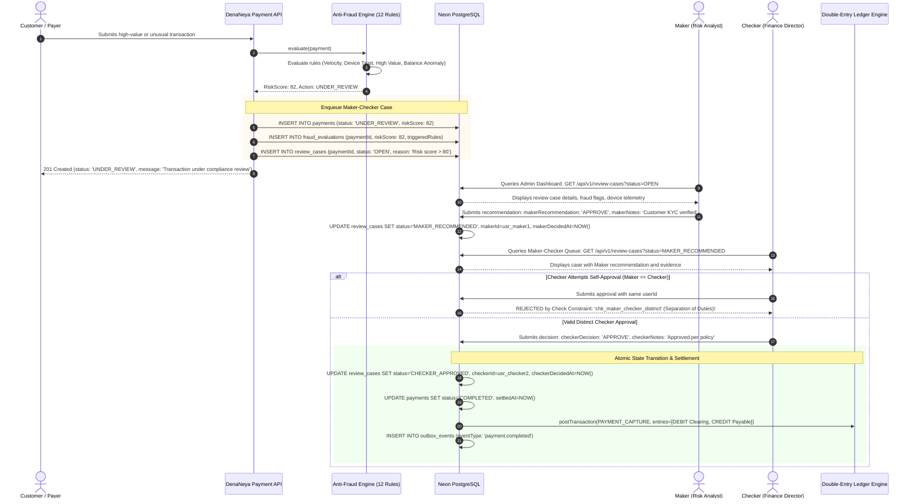

# Anti-Fraud Engine, 12-Rule Risk Scoring & Dual-Control Review Queue

> **"দেনা-নেওয়া সহজ, হিসাব নিশ্চিত।"**  
> *Seamless Payments, Guaranteed Accounting.*

This document details the multi-layered anti-fraud architecture implemented in `@denaneya/fraud-engine`, covering automated risk scoring, rule weights, classification thresholds, balance-chain verification, and the dual-control Maker-Checker review workflow.

---

## 1. Risk Management Framework & Philosophy

DenaNeya protects merchants from synthetic payment fraud, duplicate settlement abuse, stolen credentials, and compromised collector devices while maintaining low checkout friction for legitimate consumers.

Every transaction evaluated by the fraud engine receives a deterministic **Composite Risk Score** between `0` and `100`:

$$\text{RiskScore} = \min\left(100, \sum_{i=1}^{12} w_i \cdot s_i\right)$$

Where:
- $w_i$ is the static rule weight assigned to rule $i$.
- $s_i \in [0, 1]$ is the normalized severity of the triggered rule.

---

## 2. Risk Classification Tiers & Automated Action Thresholds

| Score Range | Classification | Automated System Action | Business Lifecycle Impact |
|---|---|---|---|
| **0 – 29** | `LOW` | `ALLOW` | Transaction approved immediately. Automated straight-through settlement proceeds. |
| **30 – 49** | `MEDIUM` | `MONITOR` | Transaction approved. Asynchronously flagged for retrospective audit log inspection. |
| **50 – 79** | `HIGH` | `REQUIRE_REVIEW` | Transaction held in `UNDER_REVIEW`. Routed to Maker-Checker dual-control approval queue. |
| **80 – 100** | `CRITICAL` | `AUTO_REJECT` | Immediate transition to `FAILED`. Payer blocked; TrxID quarantined. |

---

## 3. The 12 Comprehensive Risk Scoring Rules

```
Rule 1:  Reused Provider TrxID        [w = 100]  =====> AUTO-REJECT (Critical)
Rule 2:  Duplicate SMS Fingerprint    [w = 90]   =====> AUTO-REJECT (Critical)
Rule 3:  Amount Mismatch              [w = 70]   =====> Maker-Checker Review
Rule 4:  Wrong Destination Wallet     [w = 60]   =====> Maker-Checker Review
Rule 5:  Suspicious Telco Sender ID   [w = 80]   =====> AUTO-REJECT (Critical)
Rule 6:  IP Velocity Burst (>5/min)   [w = 40]   =====> Monitor / Review
Rule 7:  Merchant Velocity Surge      [w = 35]   =====> Monitor / Review
Rule 8:  Device Replay / Stale Seq    [w = 95]   =====> AUTO-REJECT (Critical)
Rule 9:  Balance-Chain Discontinuity  [w = 50]   =====> Maker-Checker Review
Rule 10: Off-Hours Transaction Spike  [w = 20]   =====> Monitor
Rule 11: High-Value Single Tx         [w = 30]   =====> Maker-Checker Review
Rule 12: IP Country / Geo Mismatch    [w = 45]   =====> Monitor / Review
```

### Detailed Rule Specifications

1. **Rule 1: Reused Provider TrxID (`reused-trx-id`, Weight: 100)**:
   Detects attempts to settle a payment using a TrxID already recorded as COMPLETED in the `payments` table. Instantly assigns score `100` and halts execution.
2. **Rule 2: Duplicate SMS Hash (`duplicate-sms`, Weight: 90)**:
   Compares SHA-256 fingerprint of incoming SMS against `sms_messages.hash`. Prevents replay of telco notifications.
3. **Rule 3: Amount Mismatch (`amount-mismatch`, Weight: 70)**:
   Triggered when the amount in the received SMS or gateway callback differs from the expected `amount_paisa` of the checkout session.
4. **Rule 4: Wrong Destination Wallet (`wrong-wallet`, Weight: 60)**:
   Detects funds deposited into an MFS MSISDN not assigned to the authenticated merchant.
5. **Rule 5: Suspicious Sender ID (`suspicious-sender`, Weight: 80)**:
   Validates sender alphanumeric tag against whitelisted telco sender tags (`bKash`, `16247`, `NAGAD`, `16167`, `ROCKET`). Blocks messages from personal mobile numbers claiming to be official MFS broadcasts.
6. **Rule 6: IP Velocity Burst (`velocity-ip`, Weight: 40)**:
   Flags more than 5 distinct payment creation attempts from the same client IP address within 60 seconds.
7. **Rule 7: Merchant Velocity Surge (`velocity-merchant`, Weight: 35)**:
   Triggers when merchant payment creation rate exceeds $300\%$ of their 7-day trailing hourly baseline.
8. **Rule 8: Device Replay / Sequence Gap (`device-replay`, Weight: 95)**:
   Detects Android collector sequence regressions or non-monotonic sequence jumps indicating message tampering or missing queue entries.
9. **Rule 9: Balance-Chain Discontinuity (`balance-chain-discontinuity`, Weight: 50)**:
   Evaluates rolling wallet balance consistency (see Section 4).
10. **Rule 10: Off-Hours Transaction Spike (`off-hours-spike`, Weight: 20)**:
    Flags sudden transaction volume surges occurring between 02:00 AM and 05:00 AM Bangladesh Standard Time (BST).
11. **Rule 11: High-Value Single Transaction (`high-value-transaction`, Weight: 30)**:
    Flags transactions exceeding 100,000.00 BDT (10,000,000 paisa) for mandatory compliance check.
12. **Rule 12: IP Geolocation Mismatch (`ip-country-mismatch`, Weight: 45)**:
    Flags hosted checkout sessions initiated from IP addresses resolving outside Bangladesh (`country != 'BD'`) when the merchant profile is domestic-only.

---

## 4. Wallet Balance-Chain Mathematical Verification

For merchants utilizing the Android SMS Collector (`apps/android`), DenaNeya tracks rolling wallet balances extracted from telco notifications. Every legitimate incoming payment must satisfy the balance chain invariant:

$$\text{Balance}_{k-1} + \text{Amount}_k - \text{Fee}_k \equiv \text{Balance}_k$$

```
Previous Rolling Balance:   43,710.50 BDT  (4371050 paisa)
+ Received Payment Amount:   1,500.00 BDT  ( 150000 paisa)
- Provider Fee Deducted:         0.00 BDT  (      0 paisa)
----------------------------------------------------------
= Expected New Balance:     45,210.50 BDT  (4521050 paisa)
Reported New SMS Balance:   45,210.50 BDT  [CHAIN VERIFIED]
```

If an attacker fabricates an SMS with a plausible amount but cannot guess the exact internal rolling balance of the merchant's SIM card down to the paisa, the balance check fails, triggering Rule 9 (`balance-chain-discontinuity`, weight 50) and escalating the transaction to the Maker-Checker review queue.

---

## 5. Dual-Control Maker-Checker Review Workflow

Transactions scored between 50 and 79 are held in `UNDER_REVIEW`. Settlement cannot occur until two distinct authorized individuals independently review and approve the transaction:



### Database Enforcement of Separation of Duties
The database enforces separation of duties at the schema level:
```sql
ALTER TABLE review_cases ADD CONSTRAINT chk_maker_checker_distinct 
    CHECK (maker_id IS NULL OR checker_id IS NULL OR maker_id <> checker_id);
```
Even if an administrator compromises an application session or manipulates the frontend UI, PostgreSQL will reject any transaction where `maker_id == checker_id`.
