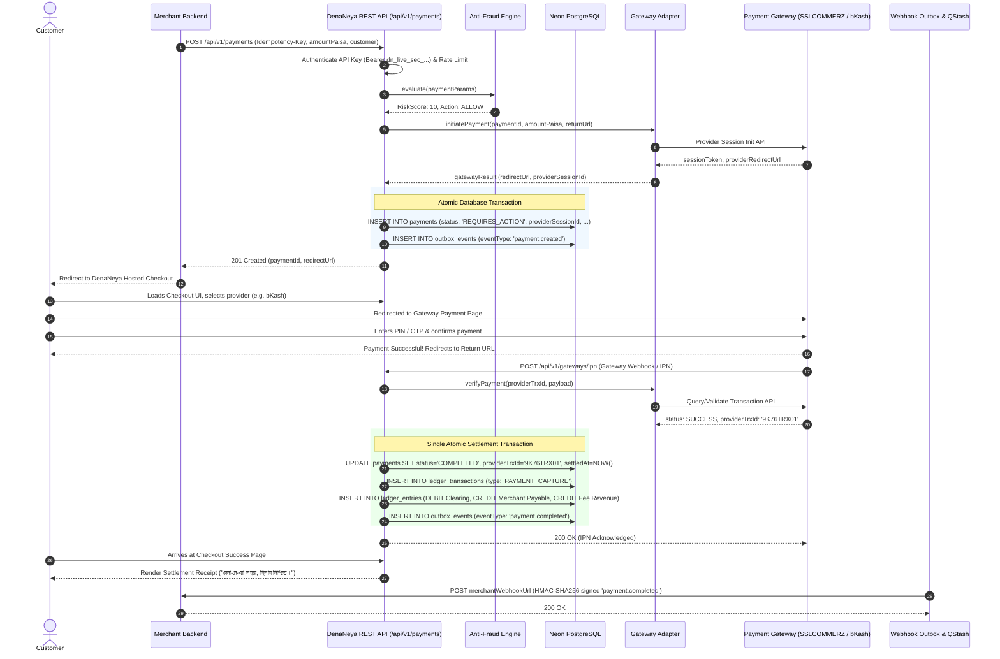

# Bangladesh Payment Gateway & MFS Adapter Integration Manual

> **"দেনা-নেওয়া সহজ, হিসাব নিশ্চিত।"**  
> *Seamless Payments, Guaranteed Accounting.*

This manual details the architecture of `@denaneya/gateway-adapters`, providing comprehensive integration specifications, authentication protocols, parameter mappings, and error normalization rules for all major Bangladesh payment service providers.

---

## 1. Gateway Adapter Architecture

DenaNeya decouples core payment processing from provider-specific protocols using the **Adapter Pattern**. Every payment provider implements the unified `GatewayAdapter` TypeScript contract:

```typescript
export interface GatewayAdapter {
  readonly providerId: ProviderType;
  readonly displayName: string;

  createPayment(params: CreatePaymentParams): Promise<GatewaySessionResult>;
  verifyPayment(params: VerifyPaymentParams): Promise<GatewayVerificationResult>;
  queryPayment(providerTrxId: string): Promise<GatewayQueryResult>;
  refund(params: RefundParams): Promise<GatewayRefundResult>;
  queryRefund(providerRefundId: string): Promise<GatewayRefundQueryResult>;
  normalizeWebhook(rawPayload: unknown, headers: Record<string, string>): NormalizedWebhookEvent;
  healthCheck(): Promise<GatewayHealthResult>;
}
```

---

## 2. Bangladesh Payment Provider Research Matrix

| Provider | Type | Primary Auth Mechanism | Card Processing | MFS Direct Wallets | Server Refund API | Automated Sandbox |
|---|---|---|---|---|---|---|
| **SSLCOMMERZ** | Payment Aggregator | Store ID + Store Password | Visa, Mastercard, Amex, UnionPay | bKash, Nagad, Rocket, Upay | Yes (`/validator/api/merchantTransIDvalidationAPI.php`) | Full Sandbox (`sandbox.sslcommerz.com`) |
| **shurjoPay** | Payment Aggregator | Username + Password + Tokenized Session | Visa, Mastercard | bKash, Nagad, Rocket | Yes (`/api/refund`) | Full Sandbox (`sandbox.shurjopayment.com`) |
| **aamarPay** | Payment Aggregator | Store ID + Signature Key | Visa, Mastercard | bKash, Nagad, Rocket, Cellfin | Semi-automated | Full Sandbox (`sandbox.aamarpay.com`) |
| **bKash PGW** | MFS Direct Gateway | App Key + App Secret + Auth Token | N/A | bKash Wallet Only | Full API (`/tokenized/checkout/payment/refund`) | Tokenized Sandbox |
| **Nagad PGW** | MFS Direct Gateway | RSA-2048 Asymmetric Keypair + AES-128-CBC | N/A | Nagad Wallet Only | Manual / Batch | Gateway Sandbox Mock |
| **Mock Simulator**| Development Engine | Local Secret / Deterministic Responses | Simulated Visa / MC | Simulated bKash / Nagad | Instant Local Settlement | Full In-Memory |

---

## 3. Provider Integration Deep-Dives

### 3.1 SSLCOMMERZ Integration
- **Session Creation**: Dispatches `POST` request to `/gwprocess/v4/api.php` with merchant credentials, amount, customer name/email/phone, currency `BDT`, and IPN/return URLs.
- **Verification API**: SSLCOMMERZ sends an Instant Payment Notification (IPN) with `val_id`. DenaNeya calls the validation server API (`/validator/api/validationserverAPI.php`) to confirm captured status, exact amount in paisa, and currency.
- **Error Normalization**: Maps SSLCOMMERZ error statuses (`FAILED`, `CANCELLED`, `UNATTEMPTED`) to typed DenaNeya payment states.

### 3.2 shurjoPay Integration
- **Token Authentication**: Retrieves an ephemeral bearer token via `POST /api/get_token`.
- **Secret Key & Decryption**: Uses shurjoPay client prefix and secret to initiate secret payment sessions.
- **Order Verification**: Queries `POST /api/verification` with `order_id` to retrieve authoritative transaction status.

### 3.3 aamarPay Integration
- **Direct POST**: Dispatches JSON payment initialization to `https://sandbox.aamarpay.com/jsonpost.php`.
- **IPN Validation**: Validates `pay_status === 'Successful'` and queries the verification endpoint with `mer_txnid`.

### 3.4 bKash Tokenized Checkout PGW
- **Grant Token API**: Generates an access token using `app_key` and `app_secret` via `POST /tokenized/checkout/token/grant`.
- **Payment Creation**: Invokes `POST /tokenized/checkout/create` specifying `amount`, `payerReference`, and `callbackURL`.
- **Execution & Capture**: Customer approves payment on the bKash checkout screen; bKash redirects to callback URL with `paymentID`. DenaNeya executes `POST /tokenized/checkout/execute` to capture funds atomically.

### 3.5 Nagad PGW
- **Asymmetric Cryptography**: Nagad uses an RSA-2048 keypair where requests are signed with DenaNeya's private key and verified with Nagad's public key. Sensitive payload fields are encrypted using AES-128-CBC.
- **Verification Flow**: Calls `/trust-edge/verify/payment/{paymentRefId}` to confirm capture.

---

## 4. Hosted Checkout & Gateway Callback Flow



---

## 5. Gateway Health Monitoring & Circuit Breaking

The platform continuously evaluates provider availability via `GET /api/v1/gateways/health`. If a provider exhibits $> 15\%$ error rates or $> 3,000\text{ms}$ latency over a 5-minute rolling window, DenaNeya temporarily flags the adapter as `DEGRADED` and dynamically routes newly initiated checkouts to healthy alternative channels.
