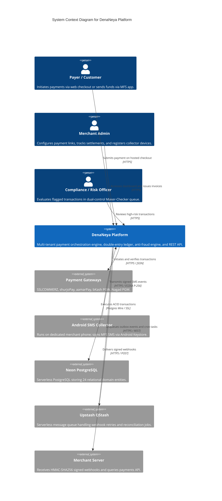

# DenaNeya Platform — Documentation Suite Index & Operations Guide

> **"দেনা-নেওয়া সহজ, হিসাব নিশ্চিত।"**  
> *Seamless Payments, Guaranteed Accounting.*

Welcome to the central technical documentation suite for **DenaNeya**, an enterprise-grade, multi-tenant payment management and orchestration platform designed specifically for the financial ecosystem of Bangladesh.

---

## 1. Executive Overview & Mission

DenaNeya bridges commercial merchants with Bangladesh's diverse payment infrastructure, including Mobile Financial Services (MFS: bKash, Nagad, Rocket, Upay) and commercial payment gateways (SSLCOMMERZ, shurjoPay, aamarPay). The platform guarantees financial integrity through zero-float integer paisa arithmetic, an immutable double-entry ledger, database-level duplicate payment protection, and hardware-attested Android SMS notification capture.

### Operating Mode: Pure Software & Orchestration

```
================================================================================
CRITICAL OPERATIONAL DISCLOSURE: SOFTWARE / ORCHESTRATION MODE ONLY
================================================================================
DenaNeya operates strictly as a software orchestration and transaction
management gateway. By default and by architecture:

    REGULATED_FEATURES_ENABLED=false

1. NON-CUSTODIAL: DenaNeya NEVER holds, custody, or pools merchant or consumer
   funds at any point in the transaction lifecycle.
2. DIRECT-TO-MERCHANT SETTLEMENT: Customer settlements flow directly through
   licensed payment service providers (PSPs) and payment system operators (PSOs)
   directly into the merchant's regulated bank account or MFS merchant wallet.
3. NO E-MONEY ISSUANCE: DenaNeya does not issue electronic money, store-value
   wallets, or credit lines.
================================================================================
```

---

## 2. Master Documentation Catalog

The platform documentation is organized into 18 specialized technical reference manuals covering architecture, security, API contracts, mobile automation, and operational runbooks:

| # | Document | Primary Target Audience | Scope & Key Topics Covered |
|---|---|---|---|
| 1 | [README.md](./README.md) | All Engineers, Integrators | Platform overview, suite navigation, quickstart, monorepo layout |
| 2 | [ARCHITECTURE.md](./ARCHITECTURE.md) | Principal Architects, Devs | C4 containers, FSM states, trust tiers, concurrency guarantees |
| 3 | [DATABASE.md](./DATABASE.md) | DBAs, Backend Engineers | Neon PostgreSQL, 24-table ERD, Drizzle ORM, check constraints |
| 4 | [SECURITY.md](./SECURITY.md) | SecOps, Security Auditors | OWASP ASVS/MASVS, AES-256-GCM envelope encryption, Argon2id, SSRF |
| 5 | [THREAT-MODEL.md](./THREAT-MODEL.md) | Security Architects, Pentesters | STRIDE threat matrix, DREAD ratings, attack surfaces, mitigations |
| 6 | [API.md](./API.md) | Merchant Developers | REST API v1 specification, Bearer auth, idempotency, RFC 7807 |
| 7 | [WEBHOOKS.md](./WEBHOOKS.md) | Merchant Integrators | Transactional outbox, HMAC-SHA256 verification (5 languages), DLQ |
| 8 | [ANDROID-SMS-AUTOMATION.md](./ANDROID-SMS-AUTOMATION.md) | Mobile Devs, Ops | Keystore EC P-256 attestation, QR pairing, Room DB, WorkManager |
| 9 | [FRAUD-PREVENTION.md](./FRAUD-PREVENTION.md) | Risk Officers, Compliance | 12 risk rules (0-100), scoring tiers, Maker-Checker dual control |
| 10 | [GATEWAY-INTEGRATIONS.md](./GATEWAY-INTEGRATIONS.md) | Integration Engineers | Adapter matrix (SSLCOMMERZ, bKash, Nagad, shurjoPay, aamarPay) |
| 11 | [DEPLOYMENT.md](./DEPLOYMENT.md) | DevOps, SREs | Infrastructure topology, Cloudflare WAF, Neon DB, zero-downtime |
| 12 | [VERCEL.md](./VERCEL.md) | Cloud Platform Engineers | Vercel Serverless (`sin1`), edge latency, headers, `vercel.json` |
| 13 | [ENVIRONMENT.md](./ENVIRONMENT.md) | DevOps, SecOps | Master 9-domain variable dictionary, secret generation, rotation |
| 14 | [BACKUP-RECOVERY.md](./BACKUP-RECOVERY.md) | SREs, DBAs | Disaster recovery, RPO/RTO SLAs, Neon PITR, encrypted cold storage |
| 15 | [INCIDENT-RESPONSE.md](./INCIDENT-RESPONSE.md) | On-Call Engineers, SREs | SEV-1 to SEV-4 runbooks, global kill-switches, post-mortem SOPs |
| 16 | [TESTING.md](./TESTING.md) | QA, All Developers | 5-tier testing pyramid, Vitest, Robolectric, cross-verification |
| 17 | [REGULATORY-NOTES.md](./REGULATORY-NOTES.md) | Legal, Compliance Officers | Bangladesh Bank PSP/PSO guidelines, ICT Act, AML/CFT reporting |
| 18 | [CHANGELOG.md](./CHANGELOG.md) | All Stakeholders | Release version history from Milestone 1 through Milestone 6 |

---

## 3. High-Level System Context



---

## 4. Monorepo Architecture & Code Layout

DenaNeya is structured as a high-performance monorepo managed with **Turborepo** and **pnpm workspaces**:

```
h:\DenaNeya/
├── apps/
│   ├── web/                           # Next.js 15 App Router (Dashboard, Checkout, REST API v1, Docs)
│   └── android/                       # Native Kotlin / Jetpack Compose Android MFS SMS Collector App
├── packages/
│   ├── payment-core/                  # Paisa math, 11-state FSM, currency types, core Zod schemas
│   ├── ledger/                        # Immutable double-entry bookkeeping engine, 5-tier accounts
│   ├── security/                      # AES-256-GCM envelope encryption, Argon2id, SSRF guard, RBAC
│   ├── sms-parser/                    # Versioned MFS SMS regex parsers, balance chaining, deduplication
│   ├── fraud-engine/                  # 12-rule risk scoring engine (0-100), Maker-Checker dual control
│   ├── gateway-adapters/              # Unified GatewayAdapter interface, SSLCOMMERZ, bKash, Nagad, etc.
│   ├── webhooks/                      # Transactional outbox engine, HMAC-SHA256 signing, exponential retry
│   ├── observability/                 # Structured JSON logging, OpenTelemetry tracing, correlation IDs
│   └── database/                      # Drizzle ORM schemas (24 tables), migrations, pool connection
├── docs/                              # All 18 production documentation files & OpenAPI 3.1 spec
│   ├── diagrams/                      # Standalone Mermaid diagrams (.mmd)
│   ├── openapi.json                   # OpenAPI 3.1.0 Specification (JSON format)
│   └── openapi.yaml                   # OpenAPI 3.1.0 Specification (YAML format)
├── .github/
│   └── workflows/
│       └── ci.yml                     # 4-job automated GitHub Actions CI/CD pipeline
├── vercel.json                        # Vercel deployment configuration (Singapore sin1, security headers)
├── .env.example                       # Comprehensive 9-domain environment configuration template
├── pnpm-workspace.yaml                # Workspace definitions
├── package.json                       # Root package manifests & dev scripts
└── turbo.json                         # Turborepo pipeline caching rules
```

---

## 5. Local Development Quickstart

### 5.1 Prerequisites
- **Node.js**: `v20.x` or `v22.x` (LTS)
- **pnpm**: `v11.17.0` (`corepack enable pnpm`)
- **Java JDK**: `17` or `21` (Temurin) for Android build
- **Android Studio / SDK**: API Level 34 (Android 14)

### 5.2 Step-by-Step Installation
1. **Clone the repository**:
   ```bash
   git clone https://github.com/denaneya/denaneya.git
   cd denaneya
   ```
2. **Install monorepo dependencies**:
   ```bash
   pnpm install --frozen-lockfile
   ```
3. **Configure environment variables**:
   ```bash
   cp .env.example .env.local
   # Review and customize database, secret, and gateway mock variables
   ```
4. **Push database schema to local/development PostgreSQL**:
   ```bash
   pnpm db:migrate
   pnpm db:seed
   ```
5. **Start local development server**:
   ```bash
   pnpm dev
   ```
   Access the web interfaces:
   - Public Marketing Portal: `http://localhost:3000`
   - Merchant Dashboard: `http://localhost:3000/dashboard`
   - Admin / Risk Review Portal: `http://localhost:3000/admin`
   - OpenAPI 3.1 Document: `http://localhost:3000/api/v1/openapi.json`

---

## 6. Monorepo Quality Gates & Verification

All code submitted to DenaNeya must pass strict automated validation:

```bash
# 1. Typecheck entire monorepo
pnpm turbo run typecheck

# 2. Lint all packages and Next.js applications
pnpm turbo run lint --filter=!@denaneya/android-collector

# 3. Execute all unit and integration test suites
pnpm turbo run test --force --filter=!@denaneya/android-collector -- --run

# 4. Execute Android native unit tests
cd apps/android && ./gradlew testDebugUnitTest

# 5. Run Android-Backend cryptographic cross-verification
cd apps/android && pnpm test:cross
```

---

## 7. Technical Invariants Summary

Every developer and contributor must adhere to the three foundational architectural invariants:

1. **Zero-Float Currency Rule**:
   All monetary amounts are strictly stored, transmitted, and calculated in integer minor units (`paisa`). Never use `float` or `number` with decimal points for financial values. `1500.00 BDT` is stored strictly as `150000`.
2. **Exactly-Once Settlement**:
   Every payment capture executes in an atomic database transaction that updates payment status, posts balanced double-entry ledger journals, marks incoming SMS or gateway tokens as consumed, and enqueues outbox events. Replay attempts must be idempotent.
3. **Defense in Depth**:
   Every external input is validated via Zod. Every merchant secret is encrypted via AES-256-GCM envelope encryption. Outbound webhook destinations are guarded against SSRF. Android events require hardware-backed EC P-256 digital signatures with monotonic sequence numbers.
