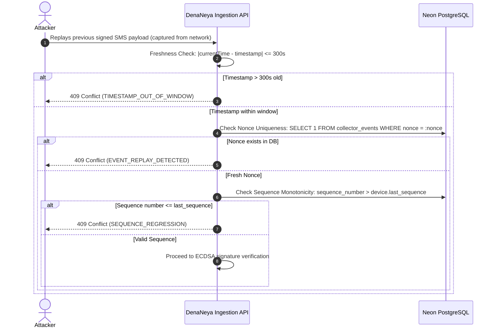

# STRIDE Threat Model & Adversarial Attack Vector Analysis

> **"দেনা-নেওয়া সহজ, হিসাব নিশ্চিত।"**  
> *Seamless Payments, Guaranteed Accounting.*

This document details the threat model for the DenaNeya payment management and orchestration platform using the **STRIDE** methodology (Spoofing, Tampering, Repudiation, Information Disclosure, Denial of Service, Elevation of Privilege) evaluated with **DREAD** risk scoring.

---

## 1. Threat Modeling Scope & Trust Boundaries

The platform spans six discrete trust boundaries separating external untrusted actors from protected financial data stores:

```
[Trust Boundary 0: Public Internet / End-Users & Payers]
                          │ (HTTPS / TLS 1.3)
                          ▼
[Trust Boundary 1: Edge Ingress / Cloudflare WAF & Vercel CDN]
                          │
                          ▼
[Trust Boundary 2: Next.js Web & API Serverless Functions]
        │                           │
        ▼                           ▼
[Trust Boundary 3: Internal DB]   [Trust Boundary 4: External Gateways]
(Neon PostgreSQL & QStash)        (bKash, Nagad, SSLCOMMERZ)
        ▲
        │ (Hardware EC P-256 Signed Envelope)
[Trust Boundary 5: Android Mobile Subsystem / Keystore]
```

### Attacker Personas
1. **Malicious Payer**: Attempts to alter payment amounts in transit, submit fake SMS receipts, or reuse legitimate TrxIDs.
2. **Rogue Merchant Operator**: Attempts to access competitor transaction records (IDOR), bypass fee schedules, or issue unbacked refunds.
3. **Compromised Mobile Device**: An Android phone whose operating system is rooted, compromised by malware, or cloned.
4. **Network Adversary (MitM)**: An attacker intercepting unencrypted transport or attempting DNS rebinding to exploit webhook delivery.
5. **Malicious Insider / Employee**: Internal personnel attempting to authorize fraudulent high-value payments without dual-control review.

---

## 2. STRIDE Threat Catalog & Mitigation Matrix

| ID | STRIDE Category | Threat Description | DREAD Score | Mitigating Architectural Control | Verification Method |
|---|---|---|---|---|---|
| **TH-01** | **Spoofing** | Adversary injects fabricated MFS SMS receipts pretending to have sent money | **Critical (14/15)** | Android Keystore hardware-backed EC P-256 signature verification over canonical JSON envelope + Trust Tier C classification | Cryptographic unit tests in `apps/android` cross-verification |
| **TH-02** | **Spoofing** | Attacker impersonates merchant webhook server to intercept or acknowledge deliveries | **Medium (9/15)** | Mutual TLS + HMAC-SHA256 signature (`X-DenaNeya-Signature`) with secret key encryption | Webhook signature test suite in `@denaneya/webhooks` |
| **TH-03** | **Tampering** | Payer modifies amount parameter in client redirect from gateway | **Critical (14/15)** | Server-to-server validation API query directly to gateway; comparison in paisa integer minor units | Gateway adapter integration tests (`@denaneya/gateway-adapters`) |
| **TH-04** | **Tampering** | Man-in-the-Middle alters incoming SMS payload on rooted Android device | **High (12/15)** | Keypair is generated in hardware Keystore (`StrongBox` / `TEE`) marked non-exportable; canonical signing occurs before network dispatch | Mobile attestation checks in Android collector |
| **TH-05** | **Repudiation** | Merchant disputes having authorized an account change or refund | **High (11/15)** | Immutable append-only audit log (`audit_logs`) with SHA-256 hash chaining | Audit log integrity verification test |
| **TH-06** | **Repudiation** | Payer denies initiating a hosted checkout transaction | **Low (6/15)** | Gateway logs payer phone number and OTP/PIN verification event; linked to DenaNeya payment ID | Gateway reconciliation audit |
| **TH-07** | **Info Disclosure** | Database snapshot exposure leaks merchant provider API secrets | **Critical (14/15)** | Field-level AES-256-GCM envelope encryption using master key external to database | DB encryption unit test in `@denaneya/security` |
| **TH-08** | **Info Disclosure** | Webhook error response leaks internal server stack trace | **Medium (8/15)** | RFC 7807 standardized `ApiError` envelope sanitizes internal exceptions; detailed logs go exclusively to structured logging | Error handler test in `apps/web/src/lib/api/errors.ts` |
| **TH-09** | **Denial of Service** | High-concurrency race condition: 20 simultaneous requests with same TrxID | **High (13/15)** | Database unique index `(provider, provider_trx_id)` guarantees exactly 1 completion; 19 fail atomically | Concurrency stress test harness (100 parallel requests) |
| **TH-10** | **Denial of Service** | Attacker specifies malicious webhook URL resolving to `169.254.169.254` (SSRF) | **High (13/15)** | Bitwise CIDR validation blocks loopback, private RFC 1918, link-local, and cloud metadata IPs | SSRF test suite in `@denaneya/security` |
| **TH-11** | **Elevation of Priv** | Merchant A accesses Merchant B's payments via IDOR (`/api/v1/payments/:id`) | **Critical (15/15)** | Server-side RBAC validates `WHERE merchant_id = session.tenantId` on every database query | Multi-tenant isolation test |
| **TH-12** | **Elevation of Priv** | Single operator approves high-value fraud review case without second review | **High (12/15)** | Database check constraint `chk_maker_checker_distinct` rejects case if `maker_id == checker_id` | Dual-control Maker-Checker test |

---

## 3. Deep-Dive: Replay Defense Architecture

Replay attacks pose severe risks in financial systems where an adversary attempts to replay an authentic SMS or API request to trigger double settlement:



### Three-Point Replay Defense Guarantees:
1. **Timestamp Freshness Window ($\pm 300\text{ seconds}$)**:
   Any request with a timestamp drifting more than 5 minutes from atomic server UTC is rejected immediately.
2. **Monotonic Sequence Numbering**:
   Every paired collector device maintains an integer sequence counter incremented on each captured event. Incoming requests with a sequence number less than or equal to the device's recorded database sequence are rejected.
3. **Cryptographic Nonce Tracking**:
   Each event carries a random 128-bit UUIDv4 nonce stored in `collector_events`. The unique index `idx_collector_events_device_nonce` enforces that no nonce is ever reused.
