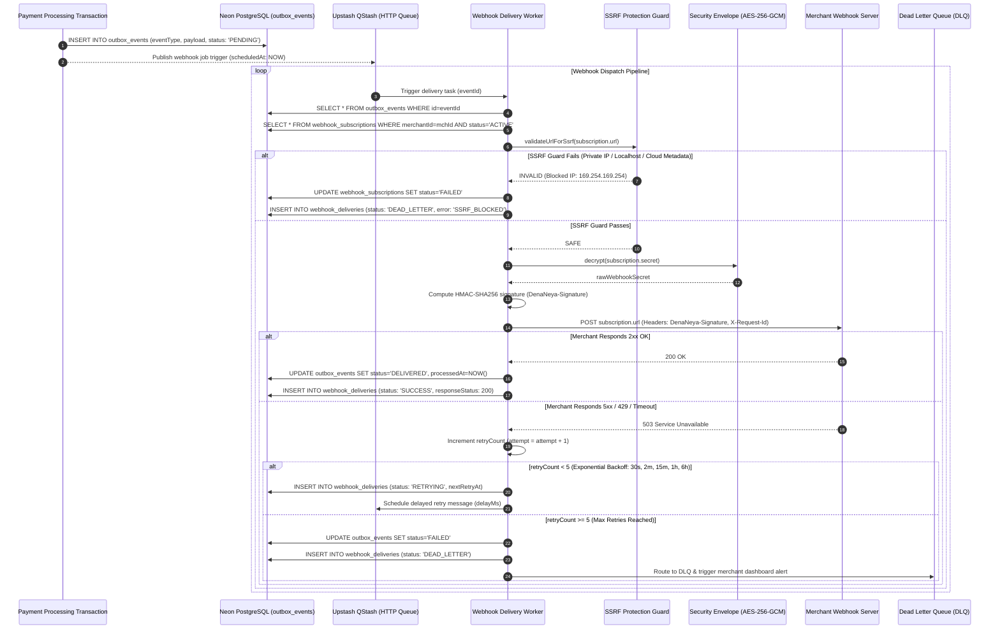

# DenaNeya Webhook Delivery Architecture & Signature Verification Manual

> **"দেনা-নেওয়া সহজ, হিসাব নিশ্চিত।"**  
> *Seamless Payments, Guaranteed Accounting.*

This manual guides merchant engineering teams on configuring, receiving, cryptographically verifying, and troubleshooting asynchronous HTTP webhook notifications from DenaNeya.

---

## 1. The Transactional Outbox Pattern

DenaNeya guarantees **at-least-once event delivery** by persisting all system events inside the primary database transaction that mutates payment or refund state. This eliminates the "dual-write" vulnerability where a payment completes in the database but the external notification fails to send:

```
┌────────────────────────────────────────────────────────────────────────┐
│                      Atomic Database Transaction                       │
│                                                                        │
│   1. UPDATE payments SET status = 'COMPLETED', settled_at = NOW()      │
│   2. INSERT INTO ledger_transactions (...)                             │
│   3. INSERT INTO ledger_entries (...)                                  │
│   4. INSERT INTO outbox_events (event_type, payload, status: 'PENDING')│
└───────────────────────────────────┬────────────────────────────────────┘
                                    │
                                    ▼ (Trigger via Upstash QStash)
                    ┌───────────────────────────────┐
                    │    Webhook Delivery Worker    │
                    │   - SSRF Hostname Validation  │
                    │   - HMAC-SHA256 Signature     │
                    │   - Exponential Backoff Queue │
                    └───────────────┬───────────────┘
                                    │
                                    ▼ (HTTPS POST)
                    ┌───────────────────────────────┐
                    │    Merchant Webhook Server    │
                    │   (Must return 2xx within 5s) │
                    └───────────────────────────────┘
```

---

## 2. Webhook Delivery & Exponential Backoff Sequence

The delivery worker handles transient merchant outages through five deterministic exponential retries before routing persistent failures to the Dead Letter Queue (DLQ):



### Exponential Retry Backoff Schedule

| Attempt # | Delay Before Retry | Cumulative Elapsed Time | Failure Action |
|---|---|---|---|
| **Initial** | Immediate (0s) | 0 seconds | If fails, schedule Retry 1 |
| **Retry 1** | 30 seconds | 30 seconds | Log warning in `webhook_deliveries` |
| **Retry 2** | 2 minutes | 2.5 minutes | Log warning |
| **Retry 3** | 15 minutes | 17.5 minutes | Log warning; increment subscription failure count |
| **Retry 4** | 1 hour | ~1.3 hours | Send warning notification to merchant admin email |
| **Retry 5** | 6 hours | ~7.3 hours | Final automated attempt |
| **DLQ** | None (Permanent) | ~7.3 hours | Route to Dead Letter Queue; requires manual replay |

---

## 3. Cryptographic Signature Verification (HMAC-SHA256)

Every outbound webhook request contains a `DenaNeya-Signature` header computed using the unique secret key disclosed when you registered your webhook subscription (`whsec_...`):

```http
DenaNeya-Signature: t=1726272000,v1=6d7e8f90a1b2c3d4e5f6...
```

The header contains:
- `t`: The Unix timestamp (in seconds) when the notification was prepared.
- `v1`: The hexadecimal HMAC-SHA256 digest of the payload.

### Verification Formula
$$\text{signed\_payload} = \text{timestamp} + \text{"."} + \text{raw\_request\_body}$$
$$\text{expected\_signature} = \text{HMAC-SHA256}(\text{secret}, \text{signed\_payload})$$

Merchants **MUST** verify the signature and ensure that $|\text{current\_time} - t| \le 300\text{ seconds}$ to prevent replay attacks.

---

## 4. Verification Code Examples in 4+ Languages

### 4.1 Node.js / TypeScript
```typescript
import crypto from 'node:crypto';

export function verifyDenaNeyaWebhook(
  rawBody: string,
  signatureHeader: string,
  secret: string,
  toleranceSeconds: number = 300
): boolean {
  const parts = signatureHeader.split(',');
  const timestampPart = parts.find(p => p.startsWith('t='));
  const signaturePart = parts.find(p => p.startsWith('v1='));

  if (!timestampPart || !signaturePart) return false;

  const timestamp = parseInt(timestampPart.substring(2), 10);
  const receivedSignature = signaturePart.substring(3);

  // Anti-replay tolerance check
  const now = Math.floor(Date.now() / 1000);
  if (Math.abs(now - timestamp) > toleranceSeconds) {
    return false;
  }

  const payloadToSign = `${timestamp}.${rawBody}`;
  const computedSignature = crypto
    .createHmac('sha256', secret)
    .update(payloadToSign, 'utf-8')
    .digest('hex');

  return crypto.timingSafeEqual(
    Buffer.from(computedSignature, 'hex'),
    Buffer.from(receivedSignature, 'hex')
  );
}
```

### 4.2 Python 3
```python
import hmac
import hashlib
import time

def verify_denaneya_webhook(raw_body: bytes, signature_header: str, secret: str, tolerance_seconds: int = 300) -> bool:
    pairs = dict(item.split('=', 1) for item in signature_header.split(','))
    if 't' not in pairs or 'v1' not in pairs:
        return False

    timestamp = int(pairs['t'])
    received_signature = pairs['v1']

    if abs(time.time() - timestamp) > tolerance_seconds:
        return False

    payload_to_sign = f"{timestamp}.".encode('utf-8') + raw_body
    computed_signature = hmac.new(secret.encode('utf-8'), payload_to_sign, hashlib.sha256).hexdigest()

    return hmac.compare_digest(computed_signature, received_signature)
```

### 4.3 PHP 8.x
```php
<?php
function verifyDenaNeyaWebhook(string $rawBody, string $signatureHeader, string $secret, int $toleranceSeconds = 300): bool {
    $parts = explode(',', $signatureHeader);
    $items = [];
    foreach ($parts as $part) {
        $kv = explode('=', $part, 2);
        if (count($kv) === 2) {
            $items[$kv[0]] = $kv[1];
        }
    }

    if (!isset($items['t']) || !isset($items['v1'])) {
        return false;
    }

    $timestamp = (int)$items['t'];
    $receivedSignature = $items['v1'];

    if (abs(time() - $timestamp) > $toleranceSeconds) {
        return false;
    }

    $payloadToSign = $timestamp . '.' . $rawBody;
    $computedSignature = hash_hmac('sha256', $payloadToSign, $secret);

    return hash_equals($computedSignature, $receivedSignature);
}
```

### 4.4 Go (Golang)
```go
package webhook

import (
	"crypto/hmac"
	"crypto/sha256"
	"encoding/hex"
	"fmt"
	"math"
	"strconv"
	"strings"
	"time"
)

func VerifyDenaNeyaWebhook(rawBody []byte, signatureHeader string, secret string, toleranceSeconds float64) bool {
	var timestamp int64
	var receivedSignature string

	parts := strings.Split(signatureHeader, ",")
	for _, part := range parts {
		kv := strings.SplitN(part, "=", 2)
		if len(kv) == 2 {
			if kv[0] == "t" {
				timestamp, _ = strconv.ParseInt(kv[1], 10, 64)
			} else if kv[0] == "v1" {
				receivedSignature = kv[1]
			}
		}
	}

	if timestamp == 0 || receivedSignature == "" {
		return false
	}

	if math.Abs(float64(time.Now().Unix()-timestamp)) > toleranceSeconds {
		return false
	}

	payloadToSign := fmt.Sprintf("%d.%s", timestamp, string(rawBody))
	mac := hmac.New(sha256.New, []byte(secret))
	mac.Write([]byte(payloadToSign))
	computedSignature := hex.EncodeToString(mac.Sum(nil))

	return hmac.Equal([]byte(computedSignature), []byte(receivedSignature))
}
```

---

## 5. Master Webhook Event Catalog

| Event Name | Description | Trigger Moment |
|---|---|---|
| `payment.created` | New payment initialized | Payer loaded hosted checkout |
| `payment.processing` | Payment callback received from upstream | Gateway acknowledged capture |
| `payment.completed` | Payment successfully settled and ledgered | Funds credited; merchant safe to fulfill order |
| `payment.failed` | Payment failed or was rejected | Gateway decline or risk score $\ge 80$ |
| `payment.under_review` | Payment held for compliance | Flagged for Maker-Checker dual control review |
| `refund.created` | Refund requested | Deducted from merchant clearing |
| `refund.completed` | Refund successfully processed | Upstream provider confirmed credit |
| `device.paired` | New Android collector device registered | QR ceremony completed |
| `device.offline` | Device heartbeat missed > 30 minutes | Warning alert sent to merchant |
